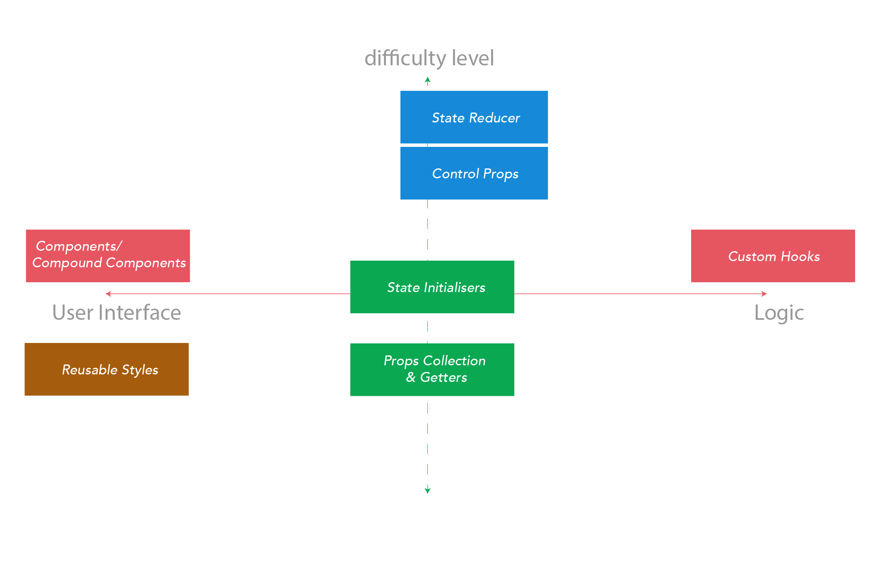

# The Complete Guide to Advanced React Component Patterns

### ¿Para qué los patrones avanzados de componentes en `React`?

- Resolver problemas relacionados con la construcción de componentes reutilizables utilizando soluciones probadas.
- Desarrollo de componentes altamente cohesivos con un acoplamiento mínimo.
- Mejores formas de compartir la lógica entre los componentes.

### ¿Qué patrones existen?

### ¿Cómo elegir el patrón adecuado?

- `Custom Hooks`: Utilzado cuando lo único que se quiere compartir es la lógica de usuario, no elementos de interfaz. Aquí un ejemplo de una llamada [ReactHooks](https://antonioru.github.io/beautiful-react-hooks/).
- `Reusable styles`: Usado cuando lo único que importa es ofrecer una interfaz UI, la implementación es sencilla y en términos de ofrecer opciones para modificar visualmente al componente.
- `Compund components`: Cuando se quiere dividir en algún tipo de relación padre e hijo, es decir, optar por descomponer las interfaces en componentes más pequeños y generar una relación jerarquica de padre e hijo.
- `State initializers` & `Props Collection Getters & Setters`: Normalmente se encuentran en el punto medio donde se requiere ofrecer lógica e interfaces de usuario, sin incrementar significativamente la dificultad e implementanción.
- `State Reducer` & `Control Props`: Permiten transferir el control de lo que se puede controlar para determinar que es lo que ocurre internamente. Sin duda se vuelven más dificiles en la implementación pero permiten ofrecer más cantidad de opciones para control interno y de interfaces a los componentes.
